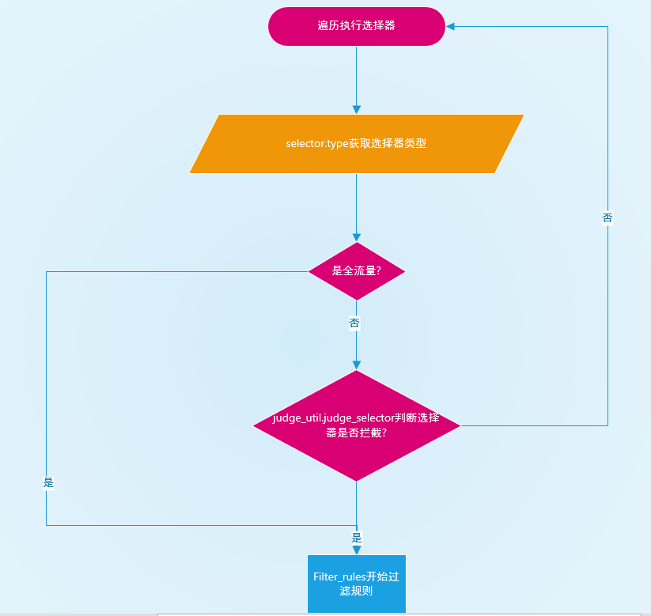

#概述
执行插件过程:
``` 
for 遍历 plugins插件:
    for 遍历插件中的selector选择器:
        for 遍历选择器中的ruler
```
# selector选择器
选择器,一个插件可以有多个选择器,一个选择器可以有多条规则.
### 选择器的数据类型
``` 
{
  "name": "选择器的名称",
  "type": 1,   //选择器类型:0:全流量;1:分流量
  "judge": {
    "type": 0,  //拦截条件类型,0:单一条件;1:and;2:or;3:复杂条件
    "conditions": [ //条件
      {
        "type": "URI", //拦截条件,根据URI
        "operator": "match", //正则匹配还是相等不等.
        "value": "拦截的uri"
      }
    ]
  },
  "handle": {  //处理方式
    "continue": true,  //继续
    "log": false //是否记录日志
  }, 
  "enable": true //是否启用
}
```
###选择器执行过程
见图:

### 关键代码解析
###### `judge_util.judge_selector`
``` 
function _M.judge_selector(selector, plugin_name)
    -- 选择器为空或者选择器没有判断条件返回
    if not selector or not selector.judge then return false end
    -- 获取selector的判断条件.
    local selector_judge = selector.judge
    local judge_type = selector_judge.type
    local conditions = selector_judge.conditions

    local selector_pass = false
    -- 根据拦截条件类型,执行不同的方法,单一匹配和and匹配执行相同的方法
    if judge_type == 0 or judge_type == 1 then
        selector_pass = _M.filter_and_conditions(conditions)
    elseif judge_type == 2 then
        selector_pass = _M.filter_or_conditions(conditions)
    elseif judge_type == 3 then
        selector_pass = _M.filter_complicated_conditions(selector_judge.expression, conditions, plugin_name)
    end

    return selector_pass
end
```
# ruler规则
### 数据类型
``` 
{
  "name": "规则名称",
  "judge": {
    "type": 0,
    "conditions": [
      {
        "type": "URI",
        "operator": "match",
        "value": ""
      }
    ]
  },
  "extractor": { //变量抽取,从请求中抽取变量用于处理
    "type": 2,
    "extractions": [
      {
        "type": "Query",
        "name": "afs"
      }
    ]
  },
  "handle": {
    "url_tmpl": "处理方式",
    "trim_qs": false,
    "redirect_status": "301",
    "log": true
  },
  "enable": false
}
```
### 处理流程
和selector差不多,也是循环处理,但是,不同的是规则分为三个阶段:
1. 处理条件,判断是否执行这个规则
2. 抽取变量,从请求中抽取变量,用于处理'
3. 处理,如果是重定向,将变量和重定向的地址结合.

# 条件过滤
无论是选择器还是规则,最终都会根据以下三个方法判断是否拦截:
* `judge.filter_and_conditions()` 判断普通和and条件
* `judge.filter_or_conditions()`判断or条件
* `judge.filter_complicated_conditions()` 判断复杂条件

而这三个方法最终又调用了`condition`中的`judge`方法.`judge`方法关键代码如下:
```
if condition_type == "URI" then
        real = ngx.var.uri
    elseif condition_type == "Query" then
        local query = ngx.req.get_uri_args()
        real = query[condition.name]
    elseif condition_type == "Header" then
        local headers = ngx.req.get_headers()
        real = headers[condition.name]
    elseif condition_type == "IP" then
        real =  ngx.var.remote_addr
    elseif condition_type == "UserAgent" then
        real =  ngx.var.http_user_agent
    elseif condition_type == "Method" then
        local method = ngx.req.get_method()
        method = string_lower(method)
        if not expected or type(expected) ~= "string" then
            expected = ""
        end
        expected = string_lower(expected)
        real = method
    elseif condition_type == "PostParams" then
        local headers = ngx.req.get_headers()
        local header = headers['Content-Type']
        if header then
            local is_multipart = string_find(header, "multipart")
            if is_multipart and is_multipart > 0 then
                return false
            end
        end

        ngx.req.read_body()
        local post_params, err = ngx.req.get_post_args()
        if not post_params or err then
            ngx.log(ngx.ERR, "[Condition Judge]failed to get post args: ", err)
            return false
        end

        real = post_params[condition.name]
    elseif condition_type == "Referer" then
        real =  ngx.var.http_referer
    elseif condition_type == "Host" then
        real =  ngx.var.host
    end
    return assert_condition(real, operator, expected)
```
如上,就是判断以下条件的类型,获取条件中的期望值和请求的真实值,然后又调用了`assert_condition`方法比较:
``` 
if operator == 'match' then
        if ngx_re_find(real, expected, 'isjo') ~= nil then
            return true
        end
    elseif operator == 'not_match' then
        if ngx_re_find(real, expected, 'isjo') == nil then
            return true
        end
    elseif operator == "=" then
        if real == expected then
            return true
        end
    elseif operator == "!=" then
        if real ~= expected then
            return true
        end
    elseif operator == '>' then
```
主要判断是根据正则还是等号,然后调用相应的方法,判断是否一样.