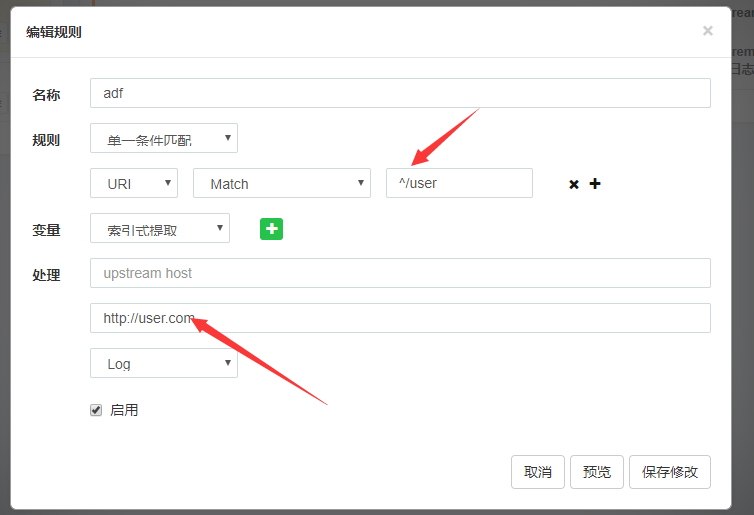

分流
===
插件名称 : divide

---
##作用
一般使用nginx,配置反向代理,如下:
``` 
upstream user.com{
    server 192.168.1.110:8080;
}
upstream product.com{
    server 192.168.1.111:8080;
}
upstream order.com{
    server 192.168.1.112:8080;
}
server{
    listen 80;
    location /product{
        proxy_pass http://product.com;
    }
    location /user{
            proxy_pass http://user.com;
    }
    location /order{
            proxy_pass http://order.com;
    }
}
```
通过使用分流,可以不用在配置文件中写具体的`location`,只需写一个location,下面时orange的nginx.conf中的一段:
``` 
upstream user.com{
    server 192.168.1.110:8080;
}
upstream product.com{
    server 192.168.1.111:8080;
}
upstream order.com{
    server 192.168.1.112:8080;
}
server{
    listen 80;
    location / {
        set $upstream_host $host;
        set $upstream_url 'http://foo.com';

        rewrite_by_lua_block {
            local orange = context.orange
            orange.redirect()
            orange.rewrite()
        }

        access_by_lua_block {
            local orange = context.orange
            orange.access()
        }

        # proxy
        proxy_set_header X-Real-IP $remote_addr;
        proxy_set_header X-Forwarded-For $proxy_add_x_forwarded_for;
        proxy_set_header X-Forwarded-Scheme $scheme;
        proxy_set_header Host $upstream_host;
        proxy_pass $upstream_url;


        header_filter_by_lua_block {
            local orange = context.orange
            orange.header_filter()
        }

        body_filter_by_lua_block {
            local orange = context.orange
            orange.body_filter()
        }

        log_by_lua_block {
            local orange = context.orange
            orange.log()
        }
    }
}
```
这样写,可以在管理界面动态增删改查url的映射.**但是,`upstream`仍然需要在配置文件中写好**
## 用法
1. 添加选择器
2. 添加规则
3. 编辑规则,添加需要转发的url,指向特定的upstream,主机可以不填,默认为当前请求头中的主机:

4. 当访问指定的url的时候,会被代理到指定的`upstream`.

另可参考: http://orange.sumory.com/docs/usages/divide/