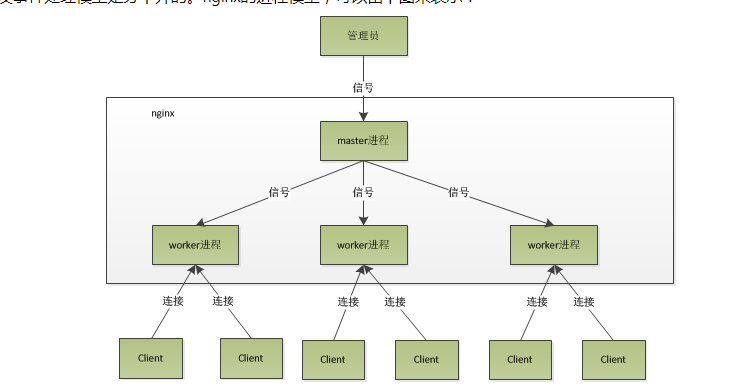

nginx架构
===
nginx在启动后，会有一个master进程和多个worker进程。进程模型如下:

[TOC]
### 指令上下文
nginx.conf中的配置信息，根据其逻辑上的意义，对它们进行了分类，也就是分成了多个作用域，或者称之为配置指令上下文。不同的作用域含有一个或者多个配置项。
*  main: nginx在运行时与具体业务功能（比如http服务或者email服务代理）无关的一些参数，比如工作进程数，运行的身份等。
*  http:	与提供http服务相关的一些配置参数。例如：是否使用keepalive啊，是否使用gzip进行压缩等。
*  server:	http服务上支持若干虚拟主机。每个虚拟主机一个对应的server配置项，配置项里面包含该虚拟主机相关的配置。在提供mail服务的代理时，也可以建立若干server.每个server通过监听的地址来区分。
*  location:	http服务中，某些特定的URL对应的一系列配置项。
*  mail:	实现email相关的SMTP/IMAP/POP3代理时，共享的一些配置项（因为可能实现多个代理，工作在多个监听地址上）。
> Nginx的配置信息分成了几个作用域(scope,有时也称作上下文)，这就是main, server, 以及location。
### 模块概述
##### 模块的分类
* **event module:**	  搭建了独立于操作系统的事件处理机制的框架，及提供了各具体事件的处理。包括ngx_events_module， ngx_event_core_module和ngx_epoll_module等。nginx具体使用何种事件处理模块，这依赖于具体的操作系统和编译选项。
* **phase handler:**  	此类型的模块也被直接称为handler模块。主要负责处理客户端请求并产生待响应内容，比如ngx_http_static_module模块，负责客户端的静态页面请求处理并将对应的磁盘文件准备为响应内容输出。
* **output filter:**  	也称为filter模块，主要是负责对输出的内容进行处理，可以对输出进行修改。例如，可以实现对输出的所有html页面增加预定义的footbar一类的工作，或者对输出的图片的URL进行替换之类的工作。
* **upstream:**  	upstream模块实现反向代理的功能，将真正的请求转发到后端服务器上，并从后端服务器上读取响应，发回客户端。upstream模块是一种特殊的handler，只不过响应内容不是真正由自己产生的，而是从后端服务器上读取的。
* **load-balancer:**  	负载均衡模块，实现特定的算法，在众多的后端服务器中，选择一个服务器出来作为某个请求的转发服务器。
### 请求处理
worker进程中，ngx_worker_process_cycle()函数就是这个无限循环的处理函数。在这个函数中，一个请求的简单处理流程如下：

1. 操作系统提供的机制（例如epoll, kqueue等）产生相关的事件。
1. 接收和处理这些事件，如是接受到数据，则产生更高层的request对象。
1. 处理request的header和body。
1. 产生响应，并发送回客户端。
1. 完成request的处理。
1. 重新初始化定时器及其他事件。
##### HTTP Request将会经过以下几个阶段的处理（phase handlers）：
* NGX_HTTP_POST_READ_PHASE:  
 	读取请求内容阶段
* NGX_HTTP_SERVER_REWRITE_PHASE:  
 	Server请求地址重写阶段
* NGX_HTTP_FIND_CONFIG_PHASE:  
 	配置查找阶段: 
* NGX_HTTP_REWRITE_PHASE:  
 	Location请求地址重写阶段
* NGX_HTTP_POST_REWRITE_PHASE:  
 	请求地址重写提交阶段
* NGX_HTTP_PREACCESS_PHASE:  
 	访问权限检查准备阶段
* NGX_HTTP_ACCESS_PHASE:  
 	访问权限检查阶段
* NGX_HTTP_POST_ACCESS_PHASE:  
 	访问权限检查提交阶段
* NGX_HTTP_TRY_FILES_PHASE:  
 	配置项try_files处理阶段
* NGX_HTTP_CONTENT_PHASE:  
 	内容产生阶段
* NGX_HTTP_LOG_PHASE:  
 	日志模块处理阶段

###### 这些阶段有一些不会调用handler,也就是不能挂载模块
* NGX_HTTP_FIND_CONFIG_PHASE
* NGX_HTTP_POST_ACCESS_PHASE
* NGX_HTTP_POST_REWRITE_PHASE
* NGX_HTTP_TRY_FILES_PHASE
